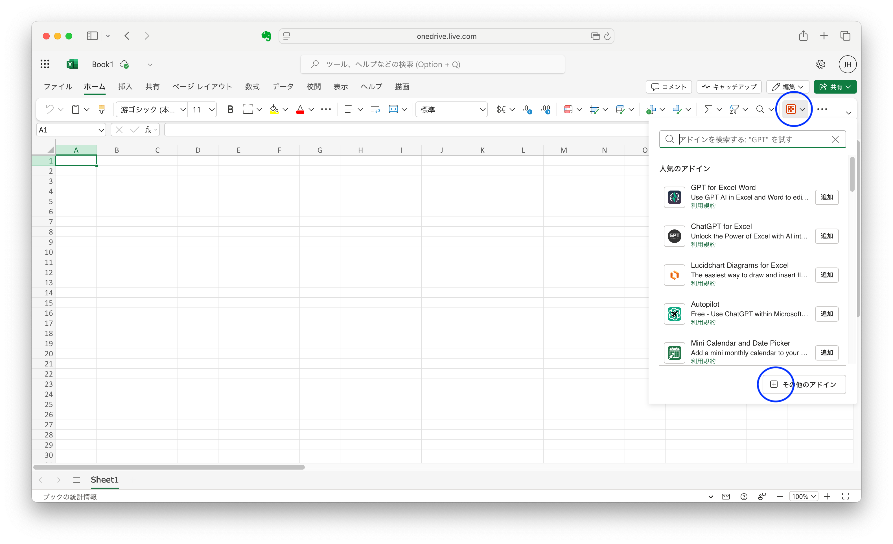
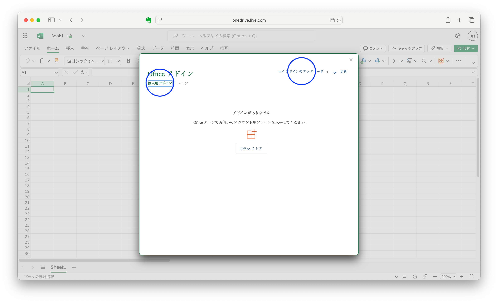
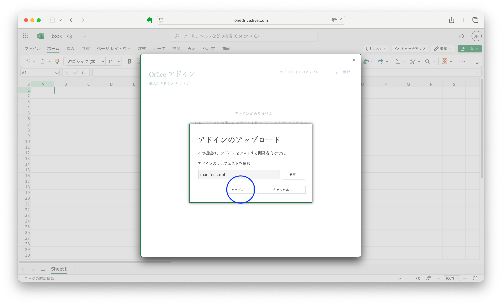
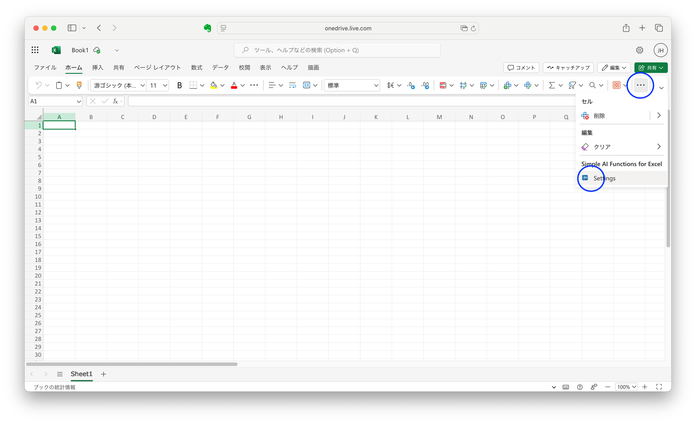
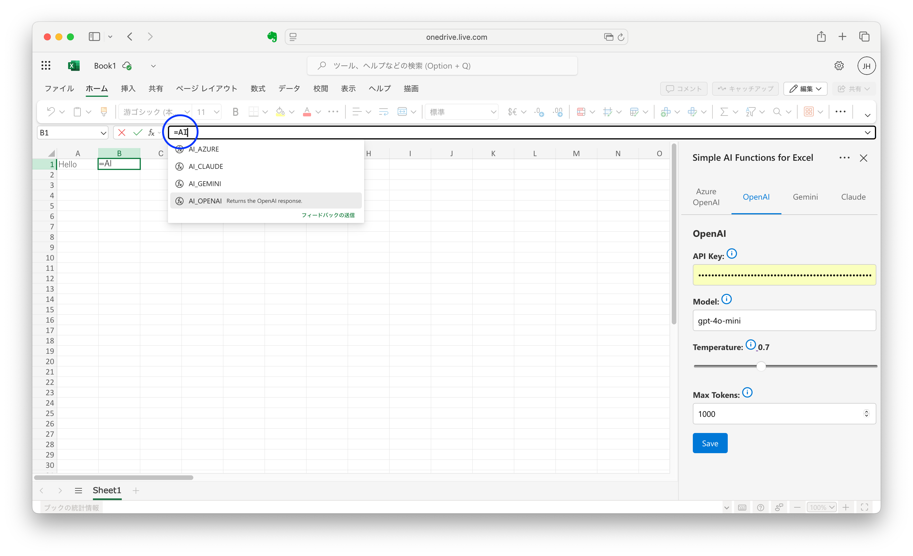
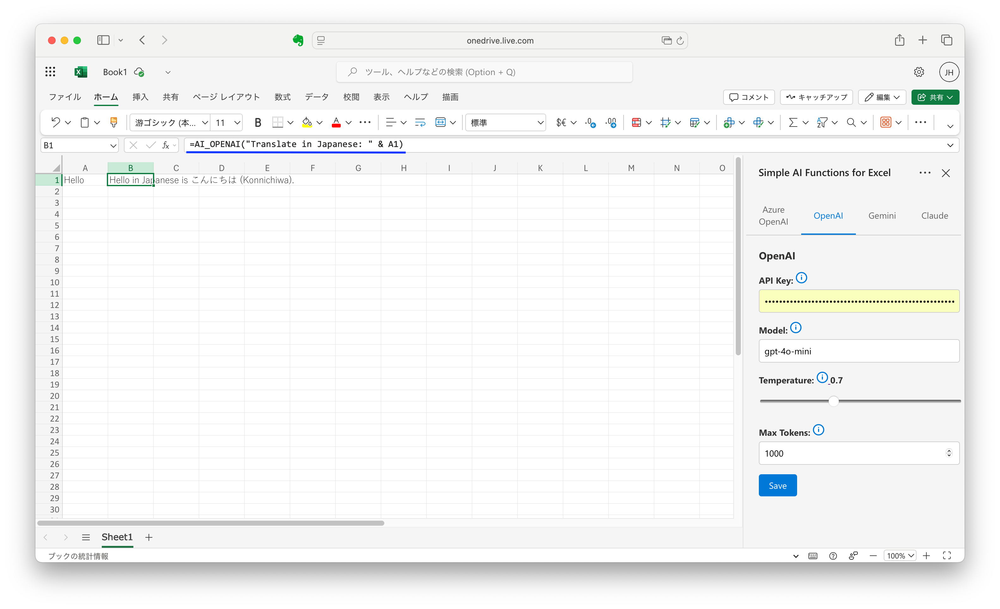

# Simple AI Functions for Excel

This add-in enables you to use AI functions directly within Excel cells.

**Note: This add-in works only with Office on the Web.**

## Requirement

You need an API key for either Azure OpenAI, OpenAI, Google Gemini, or Anthropic Claude. Google Gemini offers a free tier.

## Installation

1. Download the add-in [manifest.xml](https://1junh.github.io/aiexcel/manifest.xml) file.
2. Open Excel in your browser.
3. Select **Home** > **Add-ins**, then select **More Settings**.
4. On the **Office Add-ins** dialog, select **Upload My Add-in**.
5. **Browse** to the add-in `manifest.xml` file, and then select **Upload**.

### See also

[Sideload Office Add-ins to Office on the web](https://learn.microsoft.com/en-us/office/dev/add-ins/testing/sideload-office-add-ins-for-testing)

## How to Use

1. Select **Simple AI Functions for Excel**, then select **Settings**.
2. Select the AI tab to use, then enter the required prompt and parameters, then select **Save**.
3. Use AI_* like the followings.
   - `=AI_AZURE("test")`
   - `=AI_OPENAI("tell me" & A1)`
   - `=AI_GEMINI("tell me" & A1 & " and " & A2)`
   - `=AI_CLAUDE("hello")`
   - ...

## Uninstallation

When you clear your browser’s history and cache, the add-in will be removed.

After you leave it for a certain period of time, it will automatically be deleted from the history and cache.
If you want to use it again, you will need to reinstall it.

## ☕ Support

If you find this add-in useful, consider supporting me:
[Buy me a coffee ☕](https://coff.ee/1junh)
